<div align="center">

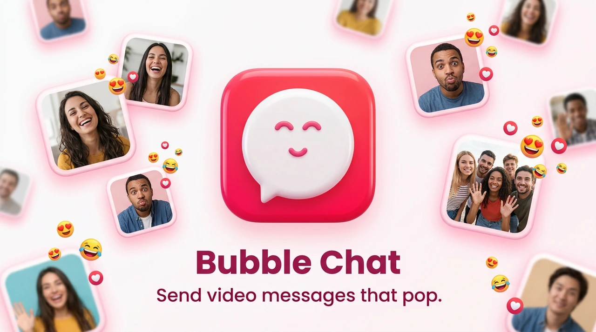

# 💬 Bubble Chat

**A native video messenger: iOS today, Android planned.**
Friends exchange short video messages (**"Bubbles"**) with reactions and replies, streamed in real time over gRPC. A full vertical slice: SwiftUI iOS app, a Swift/Vapor backend, a shared gRPC contract, and the deployment infra.


[Case study](docs/case-study.md) · [Architecture](#-architecture) · [gRPC contract](proto/) · [Build & run](#-build--run) · [Author](#-author)

<br/>

<table>
<tr>
<td width="25%">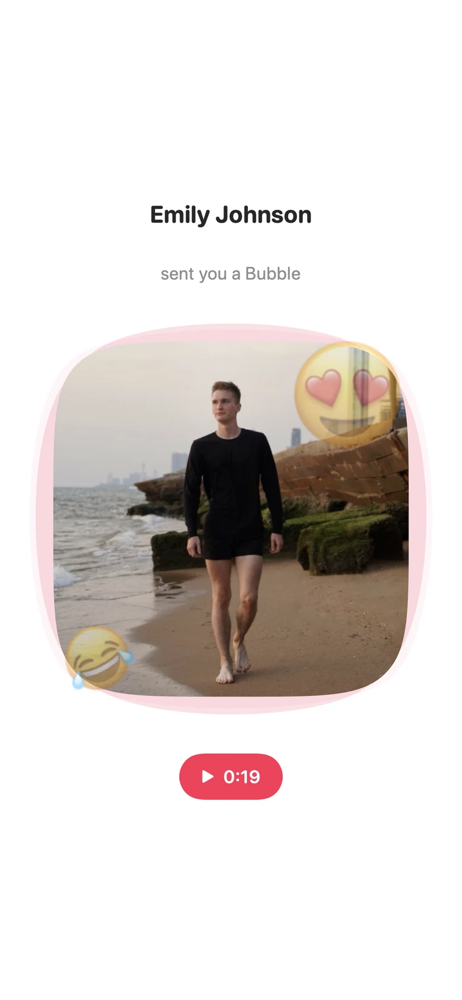</td>
<td width="25%">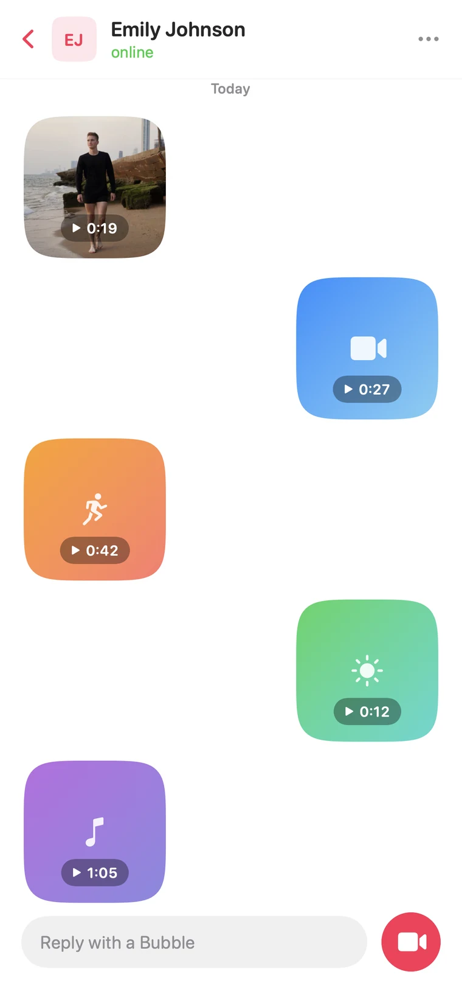</td>
<td width="25%">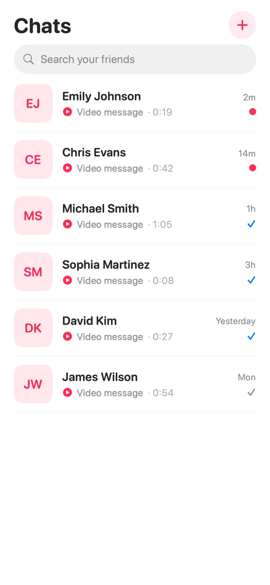</td>
<td width="25%">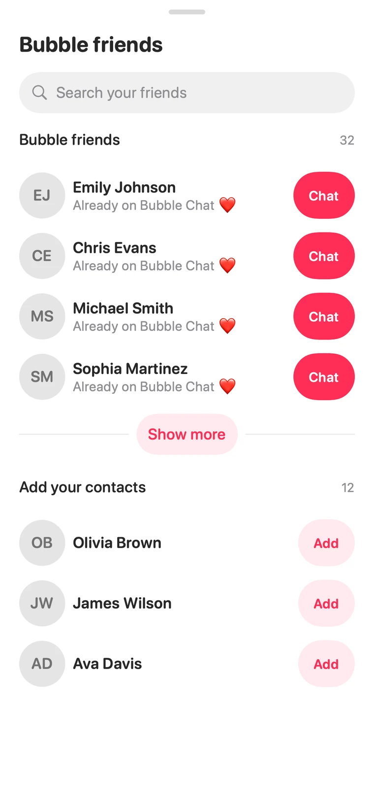</td>
</tr>
</table>

</div>

---

## What it is

**Bubble Chat** is a messenger whose primary message type is a short **video Bubble**, not text. Open a chat, record a Bubble, and it streams to your friend in real time with read/delivery state, reactions, and replies. The system is built end-to-end:

- 📱 **iOS app** (SwiftUI, iOS 17): chats, friends, camera capture, and the signature video-Bubble player.
- ☁️ **Vapor backend** (Swift): auth, users/chats/contacts, media ingestion, and the realtime engine.
- 🔌 **Shared gRPC contract**: a single set of `.proto` definitions both sides speak.
- 🚀 **Infra**: nginx reverse proxy + PostgreSQL + object storage, in Docker Compose.

**Why it's interesting**

- ⚡ **Realtime over gRPC bidirectional streaming**: not polling, not plain WebSocket. Client and server hold open `ClientToServer` / `ServerToClient` streams for messages, reactions, presence, and delivery tracking.
- 🧩 **One contract, two Swift codebases**: the iOS app and the server are generated from the same `.proto` files, so the wire format can't drift.
- 🎥 **Video-first UX**: camera capture, upload to object storage, and a custom "Bubble" player shape with reactions.
- 🛠️ **Full-stack Swift**: SwiftUI on the client, Vapor on the server, sharing models and types.

---

## 🏗 Architecture

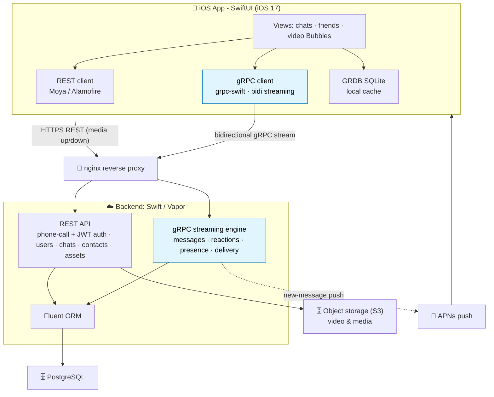

### How it works

1. **Auth.** Phone-number sign-in: the backend triggers a **flash-call** (via sms.ru) to the number; the user enters the last 4 digits of the calling number, the server verifies them and issues a **JWT** the app stores in the iOS Keychain.
2. **Realtime.** The app opens **bidirectional gRPC streams** to the server. Outbound (`ClientToServer`) carries posts/comments/reactions/delivery-acks; inbound (`ServerToClient`) pushes new content; a third stream syncs contacts + presence.
3. **Media.** A recorded video Bubble is uploaded over **REST** to **object storage**; the message references it. Recipients stream the video on demand.
4. **Persistence.** The server stores users, chats, and message metadata in **PostgreSQL** via Fluent; the app keeps a local **GRDB** cache for instant load and offline reads.
5. **Notifications.** When the recipient is offline, the server sends an **APNs** push.

---

## 🧰 Tech stack

| Layer | Technology |
|---|---|
| **iOS app** | Swift · SwiftUI (iOS 17) · grpc-swift · Moya / Alamofire · GRDB · KeychainAccess · Kingfisher / Nuke · Lottie |
| **Backend** | Swift · Vapor · Fluent (PostgreSQL) · grpc-swift · Soto (S3) · APNs · JWT |
| **Contract** | Protocol Buffers · gRPC bidirectional streaming |
| **Data** | PostgreSQL · S3-compatible object storage |
| **Infra** | Docker Compose · nginx |

---

## 📁 Repository structure

```text
bubble-chat-case/
├── ios-app/    SwiftUI iOS client (gRPC + REST, GRDB local store)
├── backend/    Swift / Vapor server (REST + gRPC streaming, Fluent, S3, APNs)
├── proto/      Shared gRPC contract (.proto) - the API both sides speak
├── infra/      nginx + PostgreSQL, Docker Compose
└── docs/       Case study + screenshots
```

---

## 📸 Screens

<table>
<tr>
<td width="33%">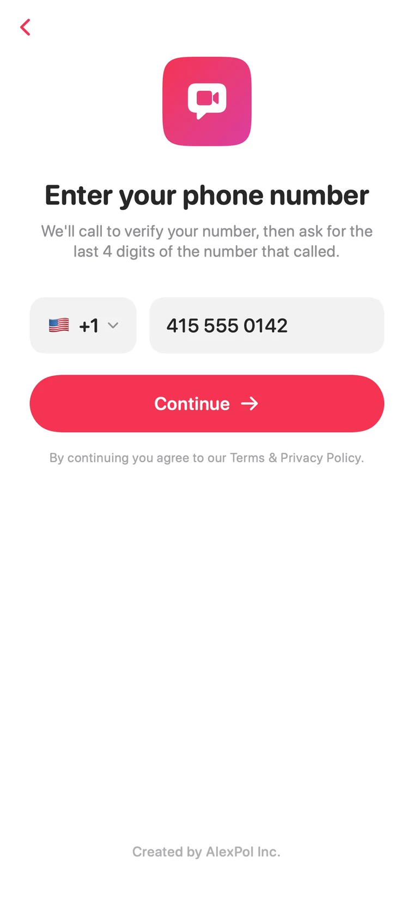<br/><sub>Sign in: phone-number auth</sub></td>
<td width="33%">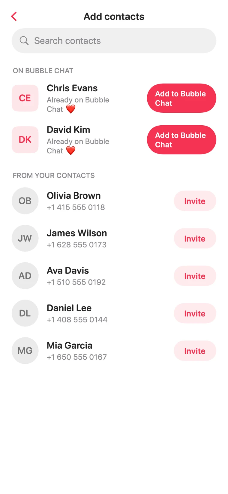<br/><sub>Find friends from your contacts</sub></td>
<td width="33%">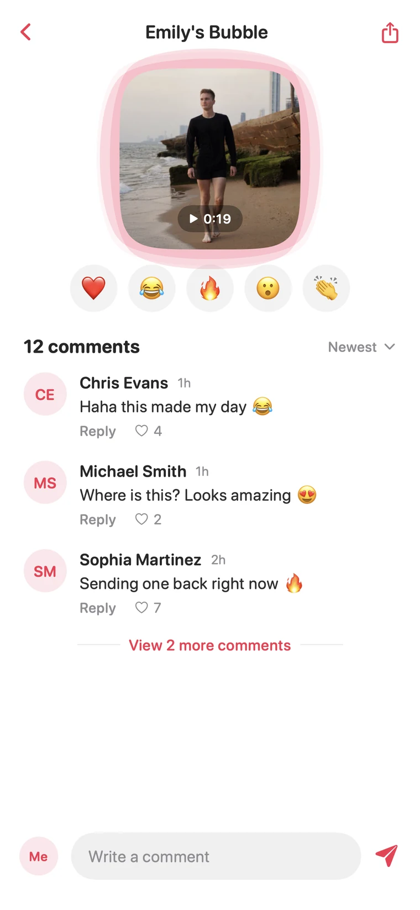<br/><sub>Comments &amp; reactions on a Bubble</sub></td>
</tr>
<tr>
<td width="33%">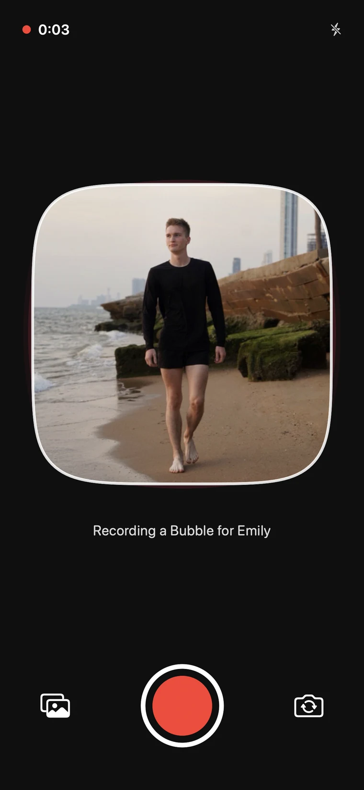<br/><sub>Capture: record a video Bubble</sub></td>
<td width="33%">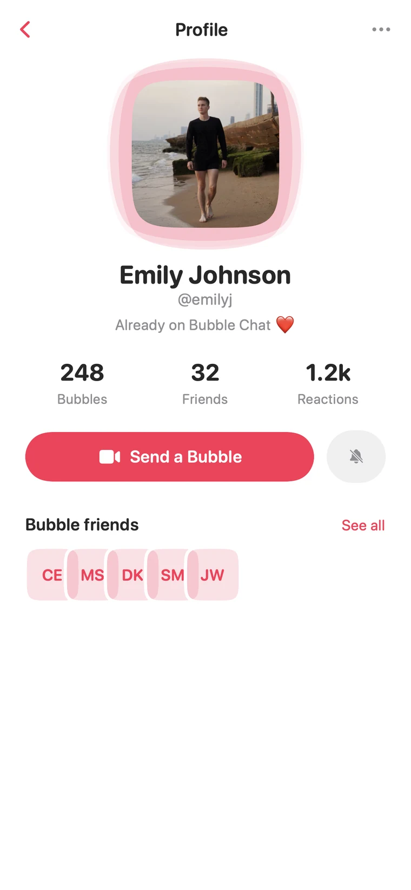<br/><sub>Profile: Bubbles, friends, reactions</sub></td>
<td width="33%">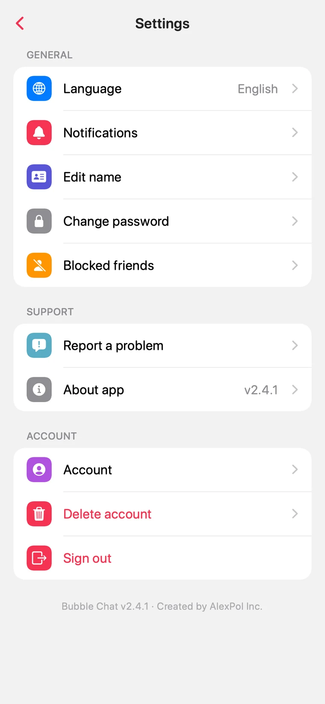<br/><sub>Settings: language, account, privacy</sub></td>
</tr>
</table>

<sub>Screens rendered from the app's real SwiftUI views and data models with sample data. No live backend. A full walkthrough is in the [case study](docs/case-study.md).</sub>

---

## 🚀 Build & run

<details>
<summary><b>iOS app (Xcode)</b></summary>

> The generated Protobuf + gRPC Swift sources (`ProtobufModels/`) are produced by codegen from the shared contract in [`proto/`](proto/) and are excluded from this repo. Building the iOS target requires running protoc with the swift + grpc-swift plugins against `proto/`. This repository showcases the architecture and application code.

```bash
cd ios-app
open BubbleChat.xcodeproj   # Swift Package Manager resolves dependencies from Package.resolved
# generate the ProtobufModels/ sources from proto/ (protoc + swift & grpc-swift plugins)
# set your backend host in BubbleChat/Constants.swift, then build to an iOS 17 device/simulator
```
See [`ios-app/README.md`](ios-app/README.md).
</details>

<details>
<summary><b>Backend (Docker Compose)</b></summary>

```bash
cd backend
cp .env.example .env                 # fill DB / JWT / APNS_* / S3_* values
# drop your Apple APNs key at Resources/AuthKey_XXXXXXXXXX.p8 (gitignored)
docker compose up --build            # or: swift build -c release
```
See [`backend/README.md`](backend/README.md) and the [gRPC contract](proto/).
</details>

<details>
<summary><b>Infra (nginx + PostgreSQL)</b></summary>

```bash
cd infra
cp .env.example .env
docker compose -f docker-compose-prod.yml up -d   # bring your own TLS cert (e.g. certbot)
```
See [`infra/README.md`](infra/README.md).
</details>

---

## 🗺 Roadmap

- [x] SwiftUI iOS client with video-Bubble capture & playback
- [x] gRPC bidirectional streaming for realtime messaging
- [x] Vapor backend: phone-call (flash-call) + JWT auth, chats, media, APNs push
- [x] Shared `.proto` contract
- [ ] End-to-end encryption for Bubbles
- [ ] Group chats
- [ ] Android client
- [ ] Web client

---

## 🧭 Project evolution

Bubble Chat began as Node.js microservices with a React Native client, then was rebuilt as a **full-stack Swift** system: a native SwiftUI app and a Vapor backend sharing a single gRPC contract. This repo presents the current Swift system; the earlier stacks were retired.

---

## 📄 License

Released under the [MIT License](LICENSE).

---

## 👤 Author

**Alex Polezhaev**, full-stack & mobile engineer.
I build end-to-end products across native iOS, server-side Swift, and realtime systems. **Relocating to the United States, open to roles.**

- GitHub: [@alex-polezhaev](https://github.com/alex-polezhaev)
- Email: polezhaev.advert@gmail.com
